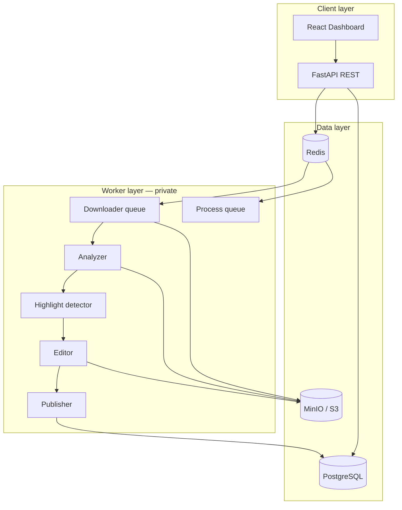

# Architecture

High-level design of **Content Mining Factory** (private production system).  
This document describes the real architecture; implementation code is not public.

## Problem

Turn long videos or YouTube compilations into vertical Shorts/Reels automatically — with quality control, batch ingest, and optional publishing.

## Modes

| Mode | Input | Strategy |
|------|-------|----------|
| **Re-Clip** | 3–15 min YouTube compilations | Find peaks *inside* pre-curated content |
| **VOD** | Raw multi-hour streams | Full-stream analysis (heavier) |

## System diagram



## Control plane

- **FastAPI** — jobs, clips, feed groups, discovery, campaigns, admin
- **PostgreSQL** — jobs, events, clips, ingested video registry, campaigns, scheduled posts
- **Redis** — Celery broker, job progress, stop/resume flags

## Worker plane (private)

Two Celery queues:

| Queue | Work | Why separate |
|-------|------|--------------|
| `download` | yt-dlp, audio extract | I/O-bound, concurrency 3 |
| `process` | Whisper, OpenCV, FFmpeg | CPU-bound, concurrency 1 |

Pipeline chain:

```
download → analyze → detect_highlights → render → [publish]
```

**Watchdog** requeues stuck jobs. **Resume** skips completed stages (e.g. reuse transcript from S3).

## Analysis stage (conceptual)

1. **Whisper** — transcription (faster-whisper, batched VAD on CPU)
2. **Audio** — librosa windows: spikes, laughter heuristics, speech rate
3. **Text** — keyword hits from transcript, category-aware lexicons
4. **Vision** — motion + scene changes via OpenCV frame sampling
5. **Webcam** — YuNet face detection → stacked layout (camera top, gameplay bottom)
6. **Exclusions** — skip intro/outro/ad segments

## Highlight detection (conceptual)

1. Fuse signals onto a time axis
2. Weight by category profile (`streamer_clip`, `football`, `meme`, …)
3. Cluster nearby peaks into candidate windows
4. Apply adaptive cap: `highlights ≈ duration_min × per_min`, clamped + quality floor
5. Optional LLM refinement / query engine

See `examples/scoring_demo.py` for a runnable simplification.

## Ingest (private)

- **Feed groups** — batch of YouTube channels
- **Registry** — dedupe, skip completed, cleanup orphans
- **Celery Beat** — scheduled ingest every N hours

## Publishing (private)

- YouTube Shorts + Instagram Reels APIs
- Campaign branding overlays
- Planner with time slots and auto-scheduling

## Storage layout

```
jobs/{id}/source.mp4
jobs/{id}/audio.wav
jobs/{id}/transcript.json
clips/{id}/clip.mp4
```

## What this doc omits (on purpose)

Implementation files, API route list, env templates, Docker Compose, and deployment runbooks remain in the **private** repository.
